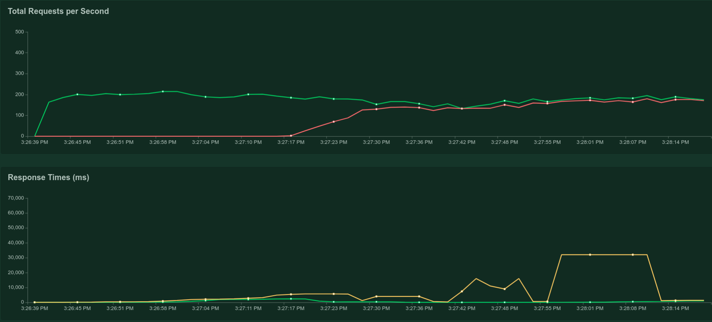
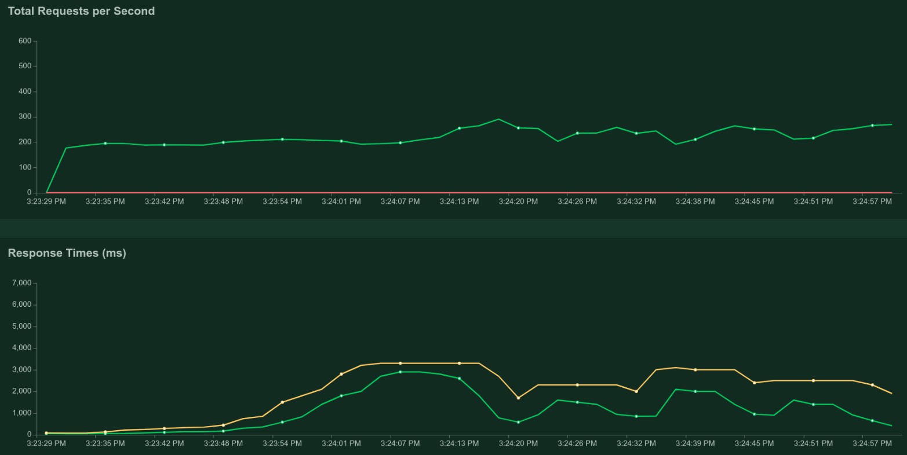

# Rudy

### Desarrollo del ejercicio
Comenzamos el ejercicio completando lo pedido en el modulo de rudy, simplemente utilizando el código con las funciones ya provistas. No tuvimos complicaciones en esta primera parte. Decidimos testear el funcionamiento de nuestro server mediante la terminal y obtuvimos nuestra primer respuesta.

Rápidamente nos dimos cuenta que un comportamiento no deseado era que al fallar el request (ya sea intencional o no), el proceso quedaba colgado. Decidimos agregar un catch al parsear el request que retorna un 500 Internal Server Error para solucionar este problema.

Para familizarnos un poco con el lenguaje y poder tener la opción de mandar no solo GET requests, implementamos un caso más de pattern matching en la función requesy_line en el módulo de http para poder manejar POSTs.

#### Incrementando el rendimiento
Para incrementar el rendimiento del server, hacemos un spawn de request con el cliente, de esta manera para atender las requests simplemente se levanta un thread y el servidor no espera para escuchar otro.  
Cuando introducimos este cambio, tuvimos un pequeño problema con erlang que nos rompió el server. Nos dimos cuenta que si queremos hacer un spawn de una función definida en el mismo archivo, tenes que exportarla igual porque al hacer el spawn no se reconoce la función.

#### Benchmark
Testeamos el server con el benchmark dado. No notamos una gran diferencia en los números al testearlo con delay, sin delay y spawneando los requests, y llegamos a la conclusión que el benchmark esperaba a obtener las respuestas para mandar el otro request. 
Quisimos probar otra herramienta para testar la performance del server, locust.io. Integrarla fue simple, agregamos un archivo de configuración al proyecto y usandolo desde la web.

- Con menos rendimiento


Pudimos observar que si el servidor espera a terminar cada request antes de procesar otro, el tiempo de respuesta sube a 30 segundos e incluso los requests comienzan a fallar por time out.

- Con mayor rendimiento


Agregando el spawn, el tiempo de respuesta se mantiene debajo de los 5 segundos y sin fallas. 


#### Devolviendo archivos
Para devolver archivos simplemente en la función reply utilizamos la URI para tener el nombre del archivo pedido. Lo leemos y si es encontrado, se devuelve con un ok. Manejamos los casos en que no se encuentre dicho archivo, devolviendo un 404 Not Found.

```erlang
reply({{get, URI, _}, _, Body}) ->
    case file:read_file("./public" ++ URI) of
        {ok, Binary} -> http:ok(Binary);
        {error, enoent} -> http:not_found("no encontrado");
        {error, _} -> http:internal_server_error("se rompio")
    end;
```

