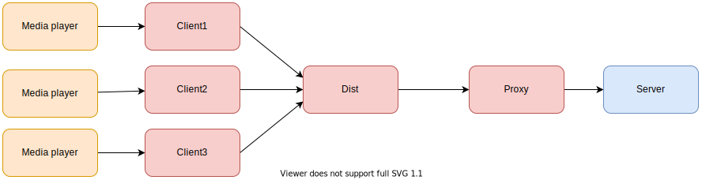
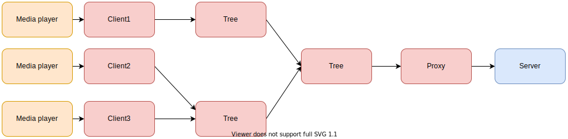
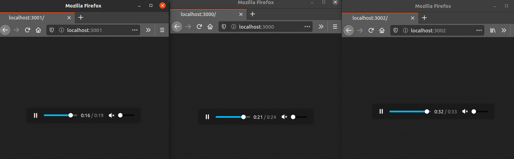

# Casty

Casty propone como objetivo construir una red de audio streaming.

## Arquitectura


## ICY

El primer modulo a implementar es ICY e implementa el protocolo del mismo nombre que es usado para hacer streaming de audio usando http.
En `icy` implementamos la lógica de enviar un request y una respuesta ICY.

## Client

Se encarga de recibir conexiones tcp por parte de un reproductor y transmitirle el stream proveniente del proxy.

## Proxy

Su responsabilidad es proveer el stream de datos proveniente de su afluente hacia el cliente conectado

## Testing

Siguiendo las pautas del enunciado, comenzamos a realizar un test usando el programa VLC para dirigirlos al stream iniciado en http://localhost:8080/. Pudimos observar que efectivamente el cliente recibe el request y se lo envía al proxy, que también lo recibe correctamente pero nos encontramos con el problema que la conexión con el servidor no podía ser establecida y luego con que el servidor esperaba un header en el request de ICY pero se obtenía uno de http.

Finalmente usamos firefox para la prueba, donde pudimos observar que efectivamente se hace streaming del audio. Una de las desventajas observadas de la solución es que solo podiamos tener un cliente.

## Dist

Una vez terminadas las pruebas iniciales con nuestros tres módulos base, implementamos el módulo `dist` cuyo objetivo es ser un intermediario entre el cliente y el proxy, ya que la solución previa solo podía conectarse un cliente por proxy y convenientemente queremos conectar varios clientes a el proceso dist y que el mismo sea el que se conecta al proxy.

Como podemos ver en el siguiente código, pudimos integrar en el proceso dist el `multicast` visto en trabajos previos, y lo usamos al recibir la data del proxy, que es reenviada a los clientes conectados.

```erlang
{data, N, Data} ->
multicast(Clients,{data, N, Data}),
loop(Clients, N+1, Context);
```

También manejamos requests de clientes que quieren conectarse al proxy y agregamos un monitor para poder dejar de enviar data innecesaria a clientes que están muertos o desconectados.

```erlang
{request, From} ->
Ref = erlang:monitor(process, From),
From ! {reply, N, Context},
loop([{Ref, From}|Clients], N, Context);
```



## Dummy

El dummy client es usado simplemente para realizar unos test ya que el distribuidor necesita un reproductor antes de conectarse al proxy.

## Tree

En la siguiente etapa del trabajo, intentamos construir un árbol distribuidor e introducimos los procesos `root` y `branch`.

### Root

El proceso root es el encargado de conectarse al proxy y esperará a que sus branches se conecten eventualmente. Al igual que el proceso dist, se conectará a la proxy y hará un multicast a sus clientes con la data recibida del mismo.
La manera en que maneja los request de conexión de un cliente es diferente, al root sólo se conectaran dos clientes y si recibe una petición de un tercero, simplemente lo redirige a una de sus ramas. Tuvimos que alterar la rama a la cual es dirigido para no desbalancear el árbol.

```erlang
loop(Clients, N, Context) ->
    receive
        {data,N,Data} ->
            multicast(Clients, {data, N, Data}),
            loop(Clients,N+1,Context);
        {request, From} ->
            L = length(Clients),
            if
              L < 2 ->
                From ! {reply, N, Context},
                loop([From|Clients], N+1, Context);
              true -> 
                [Left,Right] = Clients,
                From ! {redirect, Left},
                loop([Right,Left],N,Context)
            end
    end.
```

### Branch

El proceso branch es muy similar al root, sólo incluimos un pattern matching más en los mensajes recibidos:

```erlang
{redirect, NewProxy} ->
    connect(NewProxy, Client);
```

Para la implementación, no tuvimos en cuenta el caso en dónde muere un cliente o se desconecta. Este caso implica que tanto la raíz como las ramas deben monitorear al cliente y si este muere, el árbol debe reorganizarse quitando a ese cliente, evitando así que la redirección de un nuevo cliente a un cliente muerto causando que este nunca pueda unirse al árbol. También evita que se envíe data enviada por la proxy innecesariamente.




## More testing!

Una vez implementados los modulos de dist y tree, comenzamos a realizar unas pruebas levantando varios clientes:

- Pruebas utilizando la arquitectura con dist.



Implementamos la función stress que levanta M dummy clients para que se conecten al proxy.

```erlang
dist() ->
    Proxy = spawn(proxy, init, [?Cast]),
    register(icy, spawn(dist, init, [Proxy]).

stress(M, Proxy) ->
    case M of
    0 ->
        ok;
    N when N > 0 ->
        dummy(Proxy),
        stress(N-1, Proxy)
    end.
```


