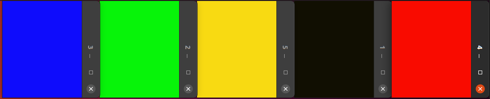

# Toty

En Toty el objetivo es implementar dos tipos de servicio multicast que seran usados por un conjunto de workers para comunicarse entre ellos.

## Worker

En la implementación del worker iniciamos un proceso de ```gui``` y un ```multicaster``` cuya iniciación esta parametrizada con el módulo dónde se implementa el servicio.
Una vez iniciados, enviamos un mensaje de join al grupo esperando la respuesta de este con el estado, en este caso el estado icluye el color y los procesos pares en el grupo.

Como menciona el enunciado, con cada mensaje recibido se calculará un nuevo color que se le enviará a la gui para poder "ver" el envío de mensajes de forma gráfica.

``` erlang
get_color(N, {R,G,B}) ->
  {G, B, ((R+N) rem 256)}.
```

Con la función get_color realizamos el cálculo del nuevo color que debe pasar a la gui.

## Multicast básico

No tuvimos muchas dificultades en la implementación del servicio de multicast básico, simplemente reenvíamos los mensajes a cada uno de los nodos pares.

```erlang
multicast(Receivers, Msg, Sleep) ->
  lists:foreach(fun (Receiver) ->
    timer:send_after(Sleep, Receiver, Msg)
  end,
  Receivers).
```

## Multicast con orden total

Esta versión de servicio de multicast implementa el orden total de los mensajes.
El servicio tiene el estado propuesto en el enunciado: Master, NextProposal, Agree, Nodes, Cast, Queue y Jitter.

## Expermentando

### Test

Con el propósito de experimentar y realizar algunas pruebas con los diferentes servicios de multicast implementados, realiamos un test que exporta dos funciones:

- ```start(Multicaster,Workers,Sleep,Jitter)``` que toma un módulo de multicast, un número de Workers a iniciar y un Sleep y Jitter.

- ```stop()``` que detiene el test.

### Experimentando con multicast básico

Realizamos varias pruebas jugando con el valor de Sleep y Jitter. Creemos que el valor de Sleep influye en el tiempo que tardan en diferir los workers al enviarse los mensajes más rápidos. 
También notamos que cuando incrementamos el valor del Jitter, la diferencia entre los colores es más notable (lo que tiene sentido, ya que el color de las ventanas es calculado a partir del orden de los mensajes y del entero recibido en ellos).

```test:start(basic_multicaster,5,1000,200).```



```test:start(basic_multicaster,5,1000,0).```


### Experimentando con multicast con orden total

Realizamos las mismas pruebas utilizando el modulo con el servicio de multicast con orden total. Como esperabamos, pudimos observar la coordinación de colores, lo que impilca que los mensajes están siendo ordenados de la misma manera por el worker.

Incluimos solo una imagen de prueba con jitter alto ya que todas las ventanas también estaban sincronizadas con el jitter en 0.

```test:start(total_multicaster,5,1000,200).```


- Tenemos muchos mensajes en el sistema?

Si, debido a que para enviar un mensaje multicast, se necesitan mandar tantos request, propuestas como nodos en el sistema y también hay que tener en cuenta el acuerdo que envía el nodo emisor a el resto de los nodos.

