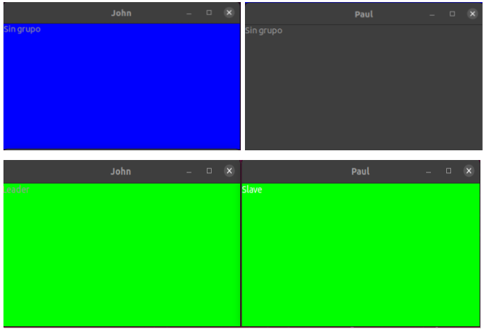

# Groupy

El trabajo consiste en la implementación se un servidor multicast que mantiene a procesos en un estado coordinado.  
La arquitectura del trabajo es de un conjunto de procesos, uno de ellos siendo el lider del grupo y el resto esclavos. Cuando un proceso esclavo le envía un mensaje al líder, este se encarga de realizar el multicast que entregará los mensajes al resto de los esclavos.

## GMS1

La primera implementación que tenemos de Groupy, simplemente coordina los procesos de tal manera que permita la suma de procesos al grupo.
Si un proceso se une a un grupo sin   `lider`, este mismo asume el rol y el resto de los procesos que se unan luego pasarán a ser `esclavos`.  
Esta implementación no garantiza nada en caso del crasheo del líder o sobre que sucede si un nodo que solicita unirse no obtiene respuesta.

## GMS2

La segunda implementación de Groupy ya comienza a tolerar fallos de los procesos pertenecientes al grupo, en particular nos interesa registrar cuando el líder falla así podemos hacer una elección de un nuevo líder. 
Para notificar a los esclavos de que el líder crasheo o fue detenido, agregamos un monitor visto en un trabajo pasado (Detector).  

```erlang
slave_monitor(Id, Master, Leader, Slaves, Group) ->
    erlang:monitor(process, Leader),
    slave(Id, Master, Leader, Slaves, Group).
```

Llamamos la función slave_monitor al inicializar un proceso slave y agregamos un pattern matching en slave para el mensaje `{'DOWN', _Ref, process, Leader, _Reason}` en donde llamamos a una relección de líder. Esta implementación de proceso de elección en particular, elige como líder al primer proceso en unirse como esclavo y notifica al resto de los esclavos que cambió su líder.  
Para probar esta implementación tuvimos un contratiempo porque usabamos la terminal como Master, y al hacer un spawn_link del lider, cuando le mandabamos el mensaje stop, el Master(terminal) terminaba junto al líder y no se hacía el proceso de elección.
Pudimos ver el funcionamiento del monitor y del proceso de elección cuando implementamos un Worker que actué como Master.

-realizamos pruebas minimizando el valor de argggg

## GMS3

En la tercera implementación de Groupy, realizamos algunos cambios que nos permiten seguir funcionando a pesar de las perdidas de mensajes, para esto haremos que se reenvien todos los mensajes antes de pasarlos al Master. Esto puede generar mensajes duplicados que solucionamos haciendo que los `slaves` mantengan un registro del último mensaje recibido de un líder y el número del siguiente mensaje esperado. Pudimos hacer los cambios pedidos sin complicaciones.

## Worker

Para realizar un experimentos, implementamos el worker con los siguientes métodos:
- `start(Gms, Id)`: hace spawn de un proceso que solicita unirse a un grupo sin líder.
- `start(Gms, Id, Grp)`: hace spawn de un proceso que solicita unirse a un grupo ya establecido.

## Gui

El worker cuenta con una gui, similar a la utilizada en Muty, para mostrar el estado del grupo asociado al worker de manera gráfica.

## Experimentos

### GMS1

Leader = worker:start(gms1,"john").


S1 = worker:start(gms1,”Paul”,Leader).



Leader ! stop.


S2 = worker:start(gs1,”Ringo”,Leader).


Como podemos observar en las pruebas, la implementación de gms1, si bien permite que si hay un lider, otros esclavos puedan unirse al grupo, una vez que el lider crashea o simplemente se para, el grupo deja de funcionar independientemente si el procesos a unirse le manda el mensaje al lider o a un nodo perteneciente al grupo.

### GMS2

Notamos que los procesos en el grupo pueden quedar de-sincronizados si el líder crashea mientras que hace un multicast de los mensajes, ya que no todos los esclavos recibirán el último mensaje.
También realizamos algunos experimentos mandandole a algún esclavo el mensaje `stop` y no observamos problemas, ya que de ser así simplemente no participará en la sincronización del grupo al no poder recibir ni enviar mensajes.


### GMS3

Realizamos las mismas pruebas con gms3 y pudimos observar la correcta coordinación de los procesos dentro del grupo, pudiendo hacer una elección del lider

## Conclusiones

Para handlear el problema donde los mensajes se pueden perder, nos parece que una solución posible es enviar una referencia junto al mensaje y esperar que el receptor nos envíe una respuesta con la misma referencia. El impacto de la performance es relativo al tiempo de trasmisión de los mensajes entre emisor y receptor. 

moreno 133328 entre french y balcarce quilmes